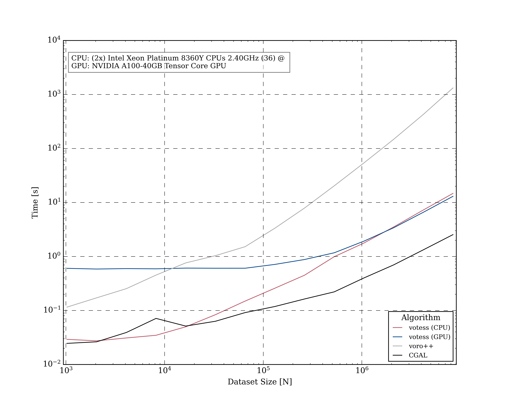

# Statement of need
 
A Voronoi tessellation is a spatial decomposition that partitions space into a
set of convex hulls based on proximity to a seed points with interesting to the
applications in biology, data science, geography, and physics. One compute
intensive application is its use in astrophysics, such as the analysis of
matter distribution [@weygaert], optimal transport theory for early-universe
reconstruction [@opticaltransport], and in observational data analysis and
numerical simulations of cosmic structure formation [@Springel2010].

The increasing size of datasets produced today have underscored the need for
more efficient algorithms to both generate and analyse these datasets, and the
rise of heterogenous computing facilities would enable such new algorithms to
be run. There do exist several sequential and parallel implementations of the
Voronoi diagram problem [@Marot]  [@WU2023102995]  [@cgal2018]  [@geogram2018],
however, they are mostly restricted to CPU or specific GPU architectures, thus
limiting their potential as a portable multi-architecture algorithm. 

# Summary

`votess` is a library, implementing Ray's meshless algorithm [@ray2018], for
computing parallel three dimensional Voronoi tessellations using the C++/SYCL
framework for CPU, GPUs and other future architectures.

One advantage of this algorithm is the ability for each cell to be computed
independently [@ray2018], making it suitable for parallel execution. It also
produces the geometry of the Voronoi cells via their neighbor connectivity
information, rather than a full combinatorial mesh data structure, thus making
it more ammenable to data parallel architectures than alternatives such as
sequential insertion or the Bowyer-Watson algorithm [@boyer1]  [@watson1].
 
The core method of `votess` consists of two main steps. First, the input set of
points is sorted into a grid, and a k-nearest neighbors search is performed.
Once the k nearest neighbors are identified for each point, the Voronoi cell is
computed by iteratively clipping a bounding box using the perpendicular
bisectors between the point and the identified neighbors. A *security radius*
condition [@securityradius] ensures that the resulting Voronoi cell is valid,
and if the cell cannot be validated, an CPU fallback mechanism is used.

## Performance

In Figure 1, we show its performance compared to two other single-threaded
Voronoi tessellation libraries: `CGAL` and `Voro++`. Both are well-tested and
widely used.  CGAL implements Voronoi Tesellations through a Delaunay mesh
using the CPU in parallel [@cgal2018], while `Voro++` computes
three-dimensional Voronoi tessellations in a single core via a cell-based
computation approach that is well-suited for physical applications
[@rycroft2009voro]. The benchmark uses a `float32` uniformly distributed
dataset, as it is currently the simplest to test. From the results of
[@ray2018], this dataset would provide the lowest performance, but higher than
clustered datasets: datasets currently beyond the scope of the current version.

Other Multithreaded Voronoi tesellelation codes exist, including `ParVoro++`
[@WU2023102995], and `GEOGRAM` [@geogram2018].  However, they do not natively
support GPU architectures, and we are unable to benchmark them.

From the graph above, `votess` outperforms the single-threaded alternative,
however, when compared to the established CGAL, both the CPU and GPU version
falls short by around a factor of 6. Currently the problem is being addressed,
and future optimizations should close the gap.
 
# Features

`votess` is designed to be versatile. It supports various outputs, including
the natural neighbor information for each Voronoi cell. This is a 2D jagged
array of neighbor indices of the sorted input dataset.
 
Users can invoke `votess` in three ways: through the C++ library, a
command-line interface `clvotess`, and a Python wrapper interface `pyvotess`.
The C++ library offers a simple interface with a `tessellate` function that
computes the mesh. The Python wrapper, mirrors the functionality of the C++
version, with native numpy array support, providing ease of use for
Python-based workflows.
 
The behavior of `votess` can be fine-tuned with run time parameters in order to
(optionally) optimize runtime performance. 
 
# Acknowledgements
 
CB and DN acknowledge funding from the Deutsche Forschungsgemeinschaft (DFG)
through an Emmy Noether Research Group (grant number NE 2441/1-1).

# References

