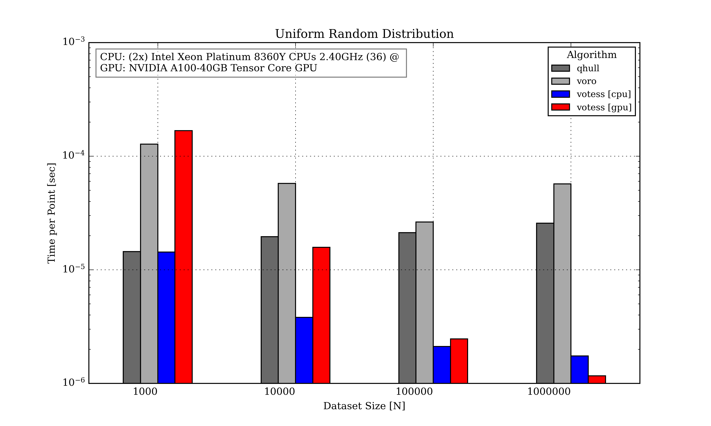

# Statement of need

Voronoi tessellation is a fundamental spatial decomposition technique widely
used in scientific domains such as astrophyics [@Springel2010], earth sciences
[], materials science [], and biochemistry []. It enables the partitioning of
space into regions based on proximity to given points, which is essential for
analyzing large datasets. Although performing Voronoi tessellations on large
datasets has been feasible for some time, the increasing complexity and size of
modern data have underscored the need for faster, more efficient computation.
With the rise of accelerator architectures like GPUs and FPGAs, the
computational power available today has greatly improved the ability to handle
these large datasets more effectively.

However, despite these advancements, most existing implementations of Voronoi
tessellations are tailored to specific platforms and architectures, limiting
their portability. This results in the need for bespoke solutions for different
hardware setups, creating inefficiencies and increasing development time.

To address this problem, `votess` provides a portable solution that can
operate across various accelerator architectures, without modification to the
source code, enabling developers within various scientific fields to be able to
make use of the new computing architectures.
 
# Summary
 
`votess` is a library for performing 3D Voronoi tessellations on heterogeneous
platforms via the SYCL framework. `votess` was designed to be portable yet
performant, with an easy-to-use interface.

The underlying algorithm is based on a paper [@ray2018], which highlights that
many applications, such as in astrophysics [] or fluid simulations [], only
require the geometry of the Voronoi cells and their neighboring information,
rather than a full combinatorial mesh data structure. This observation allows
for a simplified algorithm, as presented here, which avoids the need for
classical mesh-based approaches like the Bowyer-Watson algorithm.

The core algorithm employed by `votess` consists of two main steps. First, the
input set of points is sorted into a grid, and a k-nearest neighbors search is
performed. Once the nearest neighbors are identified for each point, the
Voronoi cell is computed by iteratively clipping a bounding box using the
perpendicular bisectors between the point and its neighbors. To optimize the
process and avoid iterating through all neighbors, a security radius condition
is applied. If a Voronoi cell cannot be validated, a CPU fallback mechanism is
used to ensures robustness.

This efficient algorithm allows for independent thread execution, making it
highly suitable for GPU parallelism. Unlike previous algorithms that relied on
sequential execution due to their mesh insertion methods [], `votess` leverages
the independence of cell computations to achieve significant speedups in
parallel environments.
 
## Performance

With a working implementation of `votess`, it can be seen that it outperforms
several single-threaded applications:

In Figure 1, we show the performance of `votess` compared to two other
single-threaded Voronoi tessellation libraries: `QHULL` and `VORO++`. `QHULL` is a
well-known computational geometry library that constructs convex hulls and
Voronoi diagrams using an indirect projection method [@10.1145/235815.235821],
while `Voro++` is a C++ library specifically designed for three-dimensional
Voronoi tessellations, utilizing a cell-based computation approach that is
well-suited for physical applications [@rycroft2009voro].

 
It can be seen that performance is best on larger datasets. The CPU
implementation outperforms other applications of atleast tenfold, and at most a
hundred fold on large datasets. It must be noted, that the benchmarks were
taken before either the CPU and GPU implementations have recieved
optimizations.

There also exists other multithreaded Voronoi tesellelation codes, such as
`ParVoro++` [@WU2023102995], `CGAL` [@cgal2018], and `GEOGRAM` [@geogram2018],
which are also widely used in large-scale computational geometry applications.
 
# Features
 
`votess` provides a versatile and efficient tool for computing Voronoi
tessellations, supporting multiple output formats including neighbor
information for each Voronoi cell. It has been tested on various CPU and GPU
architectures, delivering high performance on both platforms.

Users can leverage `votess` in three ways: through the C++ library, a
command-line interface `clvotess`, and a Python interface `pyvotess`. The C++
library offers a simple interface with a primary function, `tessellate`, that
computes the tessellation. Additionally, users can select the target device
to run said tessellation. The Python wrapper, pyvotess, mirrors the
functionality of the C++ version, providing the same ease of use for
Python-based workflows.

To fine-tune the behavior of `votess`, the class `vtargs` is provided, allowing
users to adjust parameters much like `std::unordered_map` from the STL. These
parameters can be used to optimize runtime performance if needed. The
tessellate function outputs a templated class `dnn`, representing a 2D jagged
array of neighbors contributing to each particle’s Voronoi cell of the sorted
inpute dataset, as managed via `vtargs`.  

# Acknowledgements
 
CB and DN acknowledge funding from the Deutsche Forschungsgemeinschaft (DFG)
through an Emmy Noether Research Group (grant number NE 2441/1-1).
 
# References
